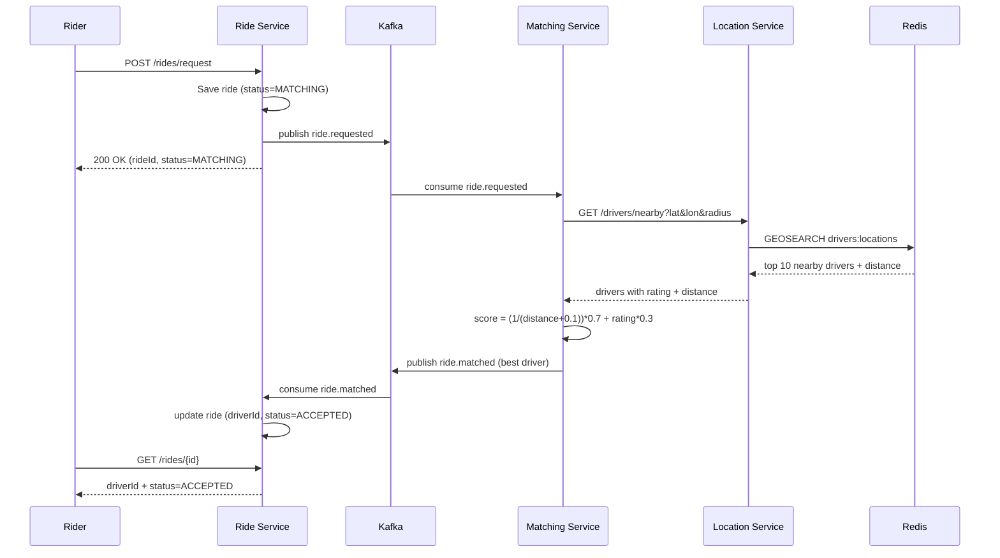
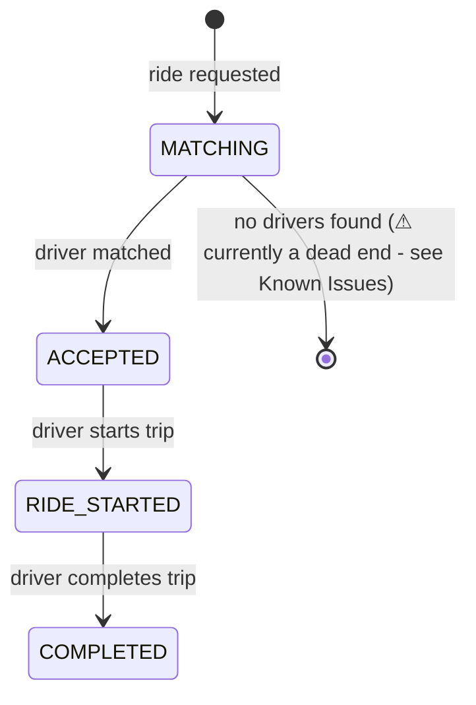

# Real-Time Ride Matching System

> 500+ drivers are moving around a city right now. How do you find the nearest one to a rider in under a second — and why does a normal SQL query fall apart when you try?

This project builds that system from scratch: a microservices-based ride-matching engine using **Redis Geospatial** for real-time driver location search, **Apache Kafka** for event-driven communication between services, and a **distance + rating weighted scoring algorithm** to pick the best driver — not just the nearest one.

Originally built by following a Spring Boot tutorial series, then extended with real load testing (up to 1,000 simulated drivers), a rewritten driver-rating system, and documented edge-case testing beyond the tutorial's happy path.

---

## Table of Contents

- [Architecture](#architecture)
- [Services](#services)
- [How Matching Actually Works](#how-matching-actually-works)
- [Design Decisions](#design-decisions)
- [Getting Started](#getting-started)
- [API Reference](#api-reference)
- [Testing at Scale](#testing-at-scale)
- [Testing Notes & Known Issues](#testing-notes--known-issues)
- [Tech Stack](#tech-stack)

---

## Architecture

Three independent Spring Boot services communicate over Kafka, backed by Redis (driver locations) and MySQL (ride records).

</a>


### Sequence of a single ride request



### Ride state machine



---

## Services

| Service | Port | Responsibility |
|---|---|---|
| **location-service** | 8082 | Tracks real-time driver locations via Redis Geospatial (`GEOADD`, `GEOSEARCH`) |
| **ride-service** | 8083 | Manages ride lifecycle (MATCHING → ACCEPTED → RIDE_STARTED → COMPLETED), publishes/consumes Kafka events, persists to MySQL |
| **matching-service** | 8084 | Consumes ride-requested events, queries location-service for nearby drivers, scores and assigns the best one |

---

## How Matching Actually Works

When a ride is requested, `matching-service` doesn't just grab the closest driver — it scores every candidate within a 5km radius using a weighted formula:

```
score = (1 / (distance_km + 0.1)) × 0.7  +  rating × 0.3
```

- **Distance (70% weight):** closer drivers score higher. The `+ 0.1` avoids division-by-zero for a driver standing exactly at the pickup point.
- **Rating (30% weight):** a driver with a meaningfully higher rating can beat a slightly closer one.

**Example, verified against real seeded data (1,000 drivers):**

| Driver | Distance | Rating | Score | Result |
|---|---|---|---|---|
| driver:449 | 0.389 km | 3.49 | 2.479 | Lost |
| driver:16 | 0.434 km | 4.80 | **2.752** | **Won** |

Only 45 meters separated these two drivers, but the ~1.3-point rating gap was enough to flip the outcome — confirming the algorithm weighs quality over pure proximity when the distance difference is small.

> Driver ratings are stored in Redis as a hash (`driver:{id}:meta` → `rating`), set once at seed/signup time — not regenerated on every match. Earlier versions of this project used `Math.random()` to simulate ratings, which made matching results non-reproducible; this was identified during testing and fixed (see [Testing Notes](#testing-notes--known-issues)).

---

## Design Decisions

| Decision | Why |
|---|---|
| **Redis Geospatial**, not SQL, for driver locations | Redis stores geo data in a sorted set, so proximity queries (`GEOSEARCH`) run in roughly logarithmic time regardless of driver count. A naive SQL scan — Haversine distance per row, no spatial index — grows *linearly* with driver count. At city scale, that gap compounds fast. |
| **Kafka**, not direct REST, between ride-service and matching-service | Decouples the two services — ride-service doesn't wait on matching to finish, and doesn't need to know how it works. Matching can be retried, scaled, or replaced independently. |
| **Weighted score** (distance + rating), not nearest-only | Pure proximity matching is naive — a rider a few meters closer to a low-rated driver isn't better served than being matched with a slightly farther, well-rated one. 70/30 favors speed of arrival while letting quality break close ties. |
| **Capped candidate pool** (top 10) before scoring | Keeps the scoring step's cost constant regardless of driver density. Redis handles the heavy filtering; scoring only ever runs against a small, bounded set. |

---

## Getting Started

### Prerequisites
- Java 17+, Maven
- Docker Desktop
- Python 3 (for load-testing scripts)

### 1. Start infrastructure
```bash
docker-compose up -d
```
Starts Redis, Zookeeper, and Kafka. MySQL is expected to run locally (see `application.yml` in `ride-service` for connection details) — adjust `docker-compose.yml` if you'd rather containerize it.

Wait ~30 seconds for Kafka to fully initialize.

### 2. Start each service (separate terminals)
```bash
cd location-service && mvn spring-boot:run
cd ride-service && mvn spring-boot:run
cd matching-service && mvn spring-boot:run
```

### 3. Seed driver data
A Python script seeds realistic driver locations across Hyderabad (clustered around real hotspots like Hitech City, Ameerpet, Secunderabad):
```bash
pip install requests
python seed_500_drivers.py
```
Uses a concurrent thread pool — seeds 1,000 drivers in a few seconds.

---

## API Reference

### Update driver location
```
POST /api/v1/locations/drivers/update
Content-Type: application/json

{
    "driverId": "driver:1",
    "latitude": 17.4400,
    "longitude": 78.3489,
    "rating": 4.7
}
```
`rating` is optional — only written on first seed/signup, omitted on routine location pings so it's never accidentally overwritten.

### Request a ride
```
POST /api/v1/rides/request
Content-Type: application/json

{
    "riderId": "rider:1",
    "pickupLatitude": 17.4400,
    "pickupLongitude": 78.3489,
    "pickupAddress": "Hitech City, Hyderabad",
    "dropLatitude": 17.4256,
    "dropLongitude": 78.4076,
    "dropAddress": "Banjara Hills, Hyderabad"
}
```

### Check ride status
```
GET /api/v1/rides/{rideId}
```

### Ride lifecycle transitions
```
PUT /api/v1/rides/{rideId}/start
PUT /api/v1/rides/{rideId}/complete
```

### Rider history
```
GET /api/v1/rides/rider/{riderId}
```

---

## Testing at Scale

Beyond the tutorial's basic 3-driver demo, this project was load-tested with realistically distributed driver data:

| Drivers seeded | Seed time | Matching result |
|---|---|---|
| 30 (hand-placed landmarks) | manual | ✅ correct |
| 500 (random, clustered) | ~14s (sequential) | ✅ correct, verified via manual scoring math |
| 1,000 (random, clustered) | ~5s (concurrent, 20 threads) | ✅ correct, verified via manual scoring math |

Each test manually cross-checked the winning driver's distance and rating against Redis (`GEOSEARCH ... WITHDIST`, `HGET driver:{id}:meta rating`) and recomputed the scoring formula by hand to confirm the algorithm's output was mathematically correct — not just "a driver got picked."

---

## Testing Notes & Known Issues

Honest accounting of what was tested and what's still rough — this is a learning project, not a production system.

### ✅ Confirmed working
- Matching stays correct and performant with 1,000 drivers in the pool
- Distance + rating weighted scoring (70/30) behaves as designed, verified manually against real Redis data at two different scales
- Ride state machine correctly blocks invalid transitions (e.g. completing before starting, starting twice)
- Driver ratings are now persistent and deterministic (fixed from an earlier version that used `Math.random()` per match, which made results non-reproducible)

### 🐛 Known issues
- **No terminal failure state for unmatched rides.** If no drivers are found within the search radius, `matching-service` logs a warning and stops — it never publishes an event back to `ride-service`. The ride stays permanently stuck in `MATCHING` status with no way for the rider to know the request failed. Fix would involve a `NO_DRIVERS_AVAILABLE` status and a corresponding Kafka event.
- **No input validation on coordinates.** Ride requests accept physically invalid coordinates (e.g. latitude 200, longitude -500) without rejection, producing nonsensical fare calculations and rides that can never be matched. Fix would involve request-level validation (`@Min`/`@Max` or a custom validator) on lat/long fields.
- **Simulated driver ratings** (fixed at seed time, random 3.5–5.0) stand in for a real driver-rating history that would come from a dedicated service in production.

---

## Tech Stack

`Spring Boot` `Apache Kafka` `Redis (Geospatial)` `MySQL` `Docker Compose` `Maven`
